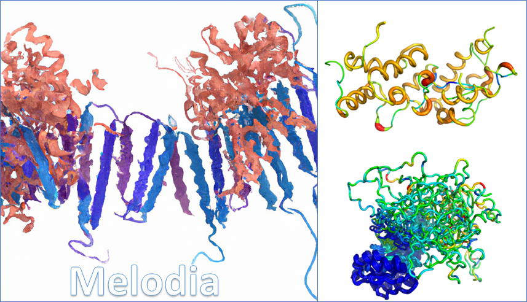

# Melodia_py
## Protein & RNA Structure Analysis

**Melodia_py** is a Python library for computing Differential Geometry
and Knot Theory descriptors of protein and RNA structures.

---

## What's new (unreleased)

> **Results change.** Curvature and torsion change for every residue past the
> first ~10 of each chain, and values near chain ends and breaks are now NaN.
> Results from v0.1.8 and earlier are not comparable with results from this
> version.

### Correctness fixes
- **Curvature and torsion no longer depend on the residue's position in the
  chain.** The local Chebyshev fit in `calc_curvature_torsion` was done on the
  raw curve parameter (the residue index). Past ~10 residues the fit lost rank
  without warning, so values depended on where a residue sat in the chain, not
  only on its local geometry: on an ideal α-helix, interior curvature ranged
  0.35–0.51 instead of a constant 0.514. Each fitting window is now mapped to
  [−1, 1], and the fit has full rank for any chain length.
- **Chains are split at breaks.** A break is two consecutive Cα atoms more than
  4.2 Å apart (missing residues, or residues dropped for a missing Cα). Each
  segment gets its own spline, so no geometry is computed over a connection
  that does not exist, and φ/ψ are `None` across the break. A single
  `ChainBreakWarning` lists the breaks found:
  ```python
  import warnings
  from melodia_py.geometryparser import ChainBreakWarning

  with warnings.catch_warnings():
      warnings.simplefilter("ignore", ChainBreakWarning)   # or "error"
      df = mel.geometry_from_structure_file("structure.pdb")
  ```
  Breaks are detected from distances, not residue numbering, so a numbering
  jump between bonded residues is not a break. RNA chains are not split yet.
- **No more copied values at chain ends.** The first and last residue used to
  repeat their neighbour's curvature and torsion, and the first and last three
  residues shared one writhing value. A value is now computed only where its
  whole window lies inside the chain or segment, and is `NaN` elsewhere:

  | Quantity | Window | `NaN` at |
  |---|---|---|
  | curvature, torsion, arc_length | residues i−1 to i+1 | first and last residue |
  | writhing | residues i−2 to i+2 | first two and last two residues |

  The residue next to each end is computed, but is biased by the spline's end
  condition (33% high on an ideal helix); from two residues in, the end has no
  effect. Drop the `NaN` rows where a complete table is needed:
  ```python
  df = df.dropna(subset=["curvature", "torsion"])
  ```
- `bfactor_from_geo`, `cluster_alignment` and `clustering.superimposer` accept
  `NaN` values: residues without a value keep the default B-factor, are left out
  of the clustering and get the cluster label `-1`, so they never form or join
  a conserved block.

### Packaging
- **`pip install melodia-py` now gives a working package.** `nglview`,
  `ipywidgets`, `numba` and `joblib` were imported by `import melodia_py` but
  not declared as dependencies, so the import failed in a clean environment.
  `numba` (≥ 0.61, the first release supporting Python 3.13) and `joblib` are
  now core dependencies. `nglview` and `ipywidgets` are only needed by the
  structure viewers, which now import them when called; install them with the
  new `viz` extra (or from conda-forge):
  ```shell
  pip install "melodia-py[viz]"
  ```

### Tests
- A `tests/` suite covers these fixes (constant values along an ideal helix,
  independence from residue numbering, chain breaks, chain ends, `NaN`
  handling). Run it from a source install (see *From source* below):
  ```shell
  pytest
  ```

---

## What's new in v0.1.8

### MDAnalysis integration
- **New entry point `geometry_from_mdanalysis()`** — compute per-residue
  backbone geometry directly from an MDAnalysis `Universe`, supporting any
  topology/trajectory format MDAnalysis can read (GROMACS GRO+XTC, AMBER,
  CHARMM DCD, mmCIF, …).  Each trajectory frame is treated as one model,
  so the output DataFrame has the same schema as `geometry_from_structure_file`
  and is immediately compatible with all downstream clustering and alignment
  functions:
  ```python
  import MDAnalysis as mda
  import melodia_py as mel

  u  = mda.Universe("ubiquitin.gro", "ubiquitin.xtc")
  df = mel.geometry_from_mdanalysis(u, n_jobs=-1)
  # model column = 0-based frame index; same columns as geometry_from_structure_file
  ```
- **Sparse frame sampling** — the `frames` parameter accepts a list of
  0-based frame indices, so long trajectories can be analysed at any stride
  without converting the file first:
  ```python
  # Every 10th frame of a 1000-frame trajectory
  df = mel.geometry_from_mdanalysis(u, frames=list(range(0, 1000, 10)))
  ```
- **MDAnalysis is an optional dependency** — importing melodia_py is
  unaffected if MDAnalysis is not installed; the `ImportError` is raised
  only when `geometry_from_mdanalysis()` is actually called.
  Install with:
  ```shell
  pip install "melodia-py[mdanalysis]"
  ```

---

## What's new in v0.1.7

### Performance
- **Parallel model processing** — `geometry_from_structure_file` and
  `geometry_from_structure` now accept an `n_jobs` parameter. For multi-model
  files (NMR ensembles, MD trajectories) this parallelises across models using
  all available CPU cores. A 300-model NMR ensemble runs **6.5× faster** with
  `n_jobs=8`:
  ```python
  df = mel.geometry_from_structure_file("ensemble.pdb", n_jobs=8)
  ```
- **Numba JIT writhing** — the Gauss writhing number double loop is compiled
  to native code via Numba `@njit`, giving ~8× speedup on that calculation.
- **Adaptive arc-length integration** — replaced the hand-rolled Euler loop
  with `scipy.integrate.quad` for higher accuracy and fewer function
  evaluations.

### RNA support
- **Configurable backbone atom** — `GeometryParser` now accepts an `rna_atom`
  parameter (default `"C4'"`) to select the Cα equivalent for RNA chains.
  `C4'` is the community standard and is universally present in all nucleotides.
  Valid choices are exposed as `GeometryParser.RNA_ATOMS`:
  ```python
  gp = GeometryParser(chain, rna_atom="C4'")   # default, recommended
  gp = GeometryParser(chain, rna_atom="P")      # phosphorus backbone
  ```

### Correctness fixes
- `phi` and `psi` are now correctly typed as `Optional[float]`. Terminal
  residues (N-terminus and C-terminus) receive `None` instead of `0.0`.
- RNA detection now uses set membership instead of substring matching,
  fixing a silent bug for multi-character residue names.
- Division-by-zero guard added in the writhing calculation for degenerate
  (colinear) atom geometries found in some PDB entries.
- `find_gaps` is now O(n) instead of O(n²).

### Build system
- Migrated from `setup.py` to `pyproject.toml` (PEP 517/518).
  Install with standard pip — no `--egg` flags needed:
  ```shell
  pip install melodia-py
  pip install "melodia-py[fast,parallel]"   # Numba + joblib extras
  pip install "melodia-py[all]"             # everything
  ```

---

## Installation

### From PyPI
```shell
# To avoid problems with installing NGLView from pip, download the environment.yml file from:
https://github.com/rwmontalvao/Melodia_py.git

# Create and activate the environment
conda env create -f environment.yml
conda activate melodia_py

# Install melodia with pip
pip install melodia-py
```

### With optional extras

| Extra | Installs | Enables |
|---|---|---|
| `viz` | nglview, ipywidgets | `view_putty()`, `view_cartoon()`, `view_tube()` in notebooks |
| `mdanalysis` | MDAnalysis | `geometry_from_mdanalysis()` for MD trajectories |
| `dev` | pytest, mypy, ruff, pre-commit | Development tools |
| `all` | all of the above | Everything |

Numba (JIT-compiled writhing) and joblib (multi-core model processing) are
installed with the core package. The former `fast` and `parallel` extras still
work but add nothing.

```shell
pip install "melodia-py[viz]"
```

### From source (recommended for development)

We recommend [Miniforge](https://github.com/conda-forge/miniforge) for
environment management.

```shell
# Clone the repository
git clone https://github.com/rwmontalvao/Melodia_py.git
cd Melodia_py

# Create and activate the environment
conda env create -f environment.yml
conda activate melodia_py

# Install in editable mode with all extras
pip install -e ".[all]"
```

---

## Quick start

```python
import melodia_py as mel

# Single-model structure
df = mel.geometry_from_structure_file("structure.pdb")

# Multi-model NMR ensemble — parallelise across models
df = mel.geometry_from_structure_file("ensemble.pdb", n_jobs=-1)

# RNA structure with C4' backbone atom (default)
df = mel.geometry_from_structure_file("rna.pdb", rna_atom="C4'")

# MD trajectory via MDAnalysis (requires melodia-py[mdanalysis])
import MDAnalysis as mda
u  = mda.Universe("ubiquitin.tpr", "ubiquitin.xtc")
df = mel.geometry_from_mdanalysis(u, n_jobs=-1)          # all frames
df = mel.geometry_from_mdanalysis(u, frames=[0, 50, 100]) # selected frames

# Inspect computed quantities
print(df.columns)
# id, model, code, chain, order, name,
# curvature, torsion, arc_length, writhing, phi, psi
```

---

## Documentation

The *examples* folder contains Jupyter Notebooks with tutorials
explaining **Melodia_py**'s functionalities.

| Notebook                                     | Open                                                                                                                                                                                        |
|----------------------------------------------|---------------------------------------------------------------------------------------------------------------------------------------------------------------------------------------------|
| Getting Started                              | [](https://colab.research.google.com/github/rwmontalvao/Melodia_py/blob/main/examples/01_getting_started.ipynb)   |
| Alignment Basics                             | [](https://colab.research.google.com/github/rwmontalvao/Melodia_py/blob/main/examples/02_alignment_basics.ipynb)  |
| Basic Similarity Analysis                    | [](https://colab.research.google.com/github/rwmontalvao/Melodia_py/blob/main/examples/03_basic_similarity_analysis.ipynb) |
| Advanced Similarity Analysis                 | [](https://colab.research.google.com/github/rwmontalvao/Melodia_py/blob/main/examples/04_advanced_similarity_analysis.ipynb) |
| Machine Learning Ensemble Analysis           | [](https://colab.research.google.com/github/rwmontalvao/Melodia_py/blob/main/examples/05_Machine_Learning_ensemble_analysis.ipynb) |
| Alignment Clustering and PDB Superimposition | [](https://colab.research.google.com/github/rwmontalvao/Melodia_py/blob/main/examples/06_alignment_clustering_and_superimposition.ipynb) |
| RNA Differential Geometry Analysis           | [](https://colab.research.google.com/github/rwmontalvao/Melodia_py/blob/main/examples/07_RNA_analysis.ipynb)      |
| Molecular Dynamics Geometry Analysis         | [](https://colab.research.google.com/github/rwmontalvao/Melodia_py/blob/main/examples/08_Molecular_Dynamics.ipynb)|
---

## Authors

- Rinaldo W. Montalvão, PhD
- Antonio Marinho da Silva Neto, PhD
- William R. Pitt, PhD

## Publication

[Melodia: a Python library for protein structure analysis](https://academic.oup.com/bioinformatics/article/40/7/btae468/7717983)  
*Bioinformatics*, 2024

## References

- Montalvão R, Smith R, Lovell S, Blundell T: CHORAL: a differential geometry approach to the prediction of the cores of protein structures. *Bioinformatics*. 2005, 21: 3719–3725.
- Chang PL, Rinne AW, Dewey TG: Structure alignment based on coding of local geometric measures. *BMC Bioinformatics*. 2006, 7:346.
- Leung H, Montaño B, Blundell T, Vendruscolo M, Montalvão R: ARABESQUE: A tool for protein structural comparison using differential geometry and knot theory. *World Res J Peptide Protein*. 2012, 1: 33–40.
- Pitt WR, Montalvão R, Blundell T: Polyphony: superposition independent methods for ensemble-based drug discovery. *BMC Bioinformatics*. 2014, 15:324.
- Marinho da Silva Neto A, Reghim Silva S, Vendruscolo M, Camilloni C, Montalvão R: A superposition free method for protein conformational ensemble analyses and local clustering based on a differential geometry representation of backbone. *Proteins*. 2018, 87(4):302–312.
- Marinho da Silva Neto A, Montalvão R, Gondim Martins DB, Lima Filho JL, Madeiros Castelletti CH: A model of key residues interactions for HPVs E1 DNA binding domain–DNA interface based on HPVs residues conservation profiles and molecular dynamics simulations. *Journal of Biomolecular Structure and Dynamics*. 2019, 38(12):3720–3729.


## Works using Melodia_py

### Articles

- Arevalo SJ, Felice VVR, Acuña MB, Flores KO, Aguilar MQ, Balan A, Farah CS: The single-particle cryo-EM structures of a bacterial cyanide dihydratase and a fungal cyanide hydratase. *Structure*. 2026, 34: 599-610.
- Li WR, Cadet XF, Medina-Ortiz D, Davari MD, Sowdhamini R, Damour C, Li Y, Miranville A, Cadet F: From thermodynamics to protein design: Diffusion models for biomolecule generation towards autonomous protein engineering. *arXiv*. 2025: arXiv:2501.02680.


### Thesis

- Rasul H: Evaluation of cell permeability in macrocyclic peptides: An exploratory computational chemistry approach. Lund University, 2025.
- Dimitriadis SA: Predicting protein-membrane interfaces of peripheral membrane proteins using machine learning. National and Kapodistian University of Athens, 2026.
